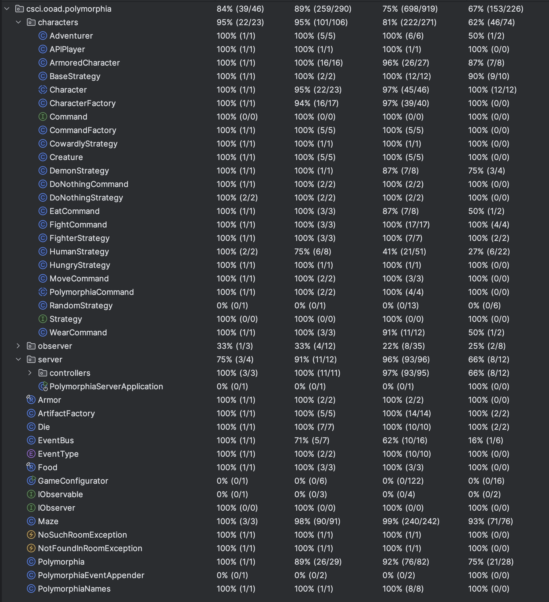
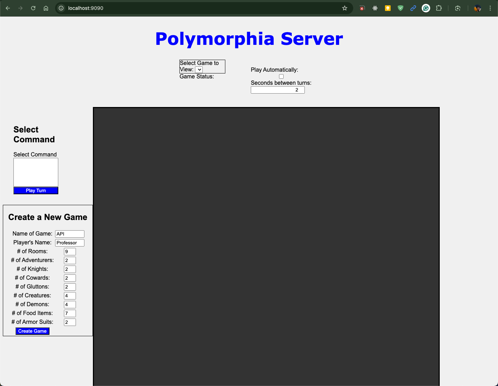

[](https://classroom.github.com/a/G64ubjiL)
# OOAD Homework 9:
## Turning Polymorphia Into a Service

#### (45 points)

NOTE: Expect some minor edits/updates

Introduction
Team Members: Grace Ohlsen, Sierra Reschke and Nolan Brady
Java Version: 21
Comments/Assumptions: None

IMPORTANT: You will submit this assignment via a link to your GIT repository. If you are re-using a repository from a previous homework, create a branch called "Homework_6" and commit all changes
for this assignment into that branch. And turn in a link to this branch.

## Code Coverage


## Grading Rubric:

### Deductions

    NOTE: for this assignment you do NOT need to worry about method coverage and you do NOT need to submit a screenshot of the coverage

* Meaningful names for everything: variables, methods, classes, interfaces, etc. (1% off for each bad name, up to 10% total)
* No "magic" numbers or strings (1% off for each one, up to 10%)
* No System.out.println() calls anywhere in your main code – replace with logging (see below) or eliminate outright. 1% off for each System.out.println statement in src/main/java code.
* 1% deduction for each missing required addition to the README.md (game outputs, screenshots, diagrams)

### Method Construction Possible Deductions

#### (max is listed under Required Capabilities)

Methods should be:
* "short" -- with very few exceptions all methods should fit on a screen using a readable font.
* well named (duh).
* properly denoted as instance methods vs. static methods (static methods don't reference the _this_ pointer).
* limited complexity (level of indentation due to control structures).
* not have comments that could be turned into just as readable code.

All of this can be achieved through functional decomposition of more complicated methods (see lecture on October 2nd).

## Required Capabilities

* Implement the Get Games Endpoint (5 points)
* Implement the Create Game Endpoint (5 points)
* Implement the Get Game Endpoint (10 points)
* Implement the Play Turn Endpoint for No-Human-Player games (5 points)
* Implement the Play Turn Endpoint for APIPlayer games (15 points)
* Complete the tests in the PolymorphiaControllerTest class (5 points)

### Hints
* A turn ends when all players have executed their turn
* but a turn will **pause** when the game needs human input (if there is a human player in the game).
* Create a new subclass of Adventurer called APIPlayer. This player will have a strategy that will be called to
  determine the next move.
* Refactor the Human Player Strategy to return list of command choices. These will be returned to the UI via the adaptor
  class (PolymorphiaJsonAdaptor).
* The Human Strategy should work for the a general Adventurer and for the API Player.
* Modify Polymorphia to check if there is an API Player in the game and handle it accordingly.
* Polymorphia needs to keep track of the players still pending in a turn.
* You'll need to finish the development of the adaptor class (PolymorphiaJsonAdaptor) that represents the game state and
  the game play for the Polymorphia game.
  This class should just consist of simple types and a constructor. You'll return it
  from some of the endpoints and it will automatically be converted to JSON.

## Definitions and Examples of Endpoints

### /api/games [GET]

Example response:

```json
[
  "Seven-room Maze",
  "API2"
]
```

### /api/game/{gameId} [GET]

Example response:

```json
{
  "name": "MyGame",
  "turn": 0,
  "inMiddleOfTurn": false,
  "gameOver": false,
  "statusMessage": "Turn 0 just ended.",
  "livingAdventurers": [
    "Arwen",
    "Professor",
    "Lady Brienne",
    "Sir Eats-a-lot",
    "Sir Lancelot",
    "Frodo",
    "Sir Robin"
  ],
  "livingCreatures": [
    "Ogre",
    "Beelzebub",
    "Satan",
    "Dragon"
  ],
  "rooms": [
    {
      "name": "Goblin's Fountain",
      "neighbors": [
        "Pool of Lava",
        "Troll Bridge"
      ],
      "contents": [
        "Lady Brienne(health: 8.00)",
        "Dragon(health: 3.00)",
        "eggs(1.9)",
        "plate-Armor"
      ]
    },
    {
      "name": "Pit of Despair",
      "neighbors": [
        "Stalactite Cave",
        "Troll Bridge"
      ],
      "contents": [
        "Frodo(health: 5.00)",
        "Sir Robin(health: 5.00)",
        "fries(2.0)",
        "pizza(1.4)"
      ]
    },
    {
      "name": "Pool of Lava",
      "neighbors": [
        "Goblin's Fountain",
        "Dungeon",
        "Stalactite Cave"
      ],
      "contents": [
        "Ogre(health: 3.00)",
        "Beelzebub(health: 15.00)"
      ]
    },
    {
      "name": "Dungeon",
      "neighbors": [
        "Pool of Lava",
        "Dragon's Den"
      ],
      "contents": [
        "cupcake(1.7)",
        "banana(1.7)"
      ]
    },
    {
      "name": "Dragon's Den",
      "neighbors": [
        "Dungeon",
        "Stalactite Cave"
      ],
      "contents": [
        "Sir Lancelot(health: 8.00)",
        "Sir Eats-a-lot(health: 5.00)",
        "salad(1.6)"
      ]
    },
    {
      "name": "Stalactite Cave",
      "neighbors": [
        "Pit of Despair",
        "Pool of Lava",
        "Dragon's Den"
      ],
      "contents": [
        "Arwen(health: 5.00)",
        "Satan(health: 15.00)",
        "Professor(health: 8.00)",
        "burger(1.4)",
        "chainmail-Armor"
      ]
    },
    {
      "name": "Troll Bridge",
      "neighbors": [
        "Goblin's Fountain",
        "Pit of Despair"
      ],
      "contents": [
        "apple(1.6)",
        "steak(1.8)",
        "bacon(1.2)",
        "leather-Armor"
      ]
    }
  ],
  "availableCommands": []
}
```

### /api/game/create [POST]

This endpoint creates a new game. The request body will be a JSON object with the fields shown below.
You'll need to create a record class to represent this request. Your endpoint declaration will look like this:

```java

@PostMapping("/api/game/create")
public ResponseEntity<?> createGame(@Validated @RequestBody PolymorphiaParameters params) {
}
```

Example request:

```json
{
  "name": "MyGame",
  "playerName": "Professor",
  "numRooms": 7,
  "numAdventurers": 2,
  "numCreatures": 2,
  "numKnights": 1,
  "numCowards": 1,
  "numGluttons": 1,
  "numDemons": 2,
  "numFood": 10,
  "numArmor": 3
}
```

Example response:

```json
{
  "name": "MyGame",
  "turn": 0,
  "inMiddleOfTurn": false,
  "gameOver": false,
  "statusMessage": "Turn 0 just ended.",
  "livingAdventurers": [
    "Arwen",
    "Professor",
    "Lady Brienne",
    "Sir Eats-a-lot",
    "Sir Lancelot",
    "Frodo",
    "Sir Robin"
  ],
  "livingCreatures": [
    "Ogre",
    "Beelzebub",
    "Satan",
    "Dragon"
  ],
  "rooms": [
    {
      "name": "Goblin's Fountain",
      "neighbors": [
        "Pool of Lava",
        "Troll Bridge"
      ],
      "contents": [
        "Lady Brienne(health: 8.00)",
        "Dragon(health: 3.00)",
        "eggs(1.9)",
        "plate-Armor"
      ]
    },
    {
      "name": "Pit of Despair",
      "neighbors": [
        "Stalactite Cave",
        "Troll Bridge"
      ],
      "contents": [
        "Frodo(health: 5.00)",
        "Sir Robin(health: 5.00)",
        "fries(2.0)",
        "pizza(1.4)"
      ]
    },
    {
      "name": "Pool of Lava",
      "neighbors": [
        "Goblin's Fountain",
        "Dungeon",
        "Stalactite Cave"
      ],
      "contents": [
        "Ogre(health: 3.00)",
        "Beelzebub(health: 15.00)"
      ]
    },
    {
      "name": "Dungeon",
      "neighbors": [
        "Pool of Lava",
        "Dragon's Den"
      ],
      "contents": [
        "cupcake(1.7)",
        "banana(1.7)"
      ]
    },
    {
      "name": "Dragon's Den",
      "neighbors": [
        "Dungeon",
        "Stalactite Cave"
      ],
      "contents": [
        "Sir Lancelot(health: 8.00)",
        "Sir Eats-a-lot(health: 5.00)",
        "salad(1.6)"
      ]
    },
    {
      "name": "Stalactite Cave",
      "neighbors": [
        "Pit of Despair",
        "Pool of Lava",
        "Dragon's Den"
      ],
      "contents": [
        "Arwen(health: 5.00)",
        "Satan(health: 15.00)",
        "Professor(health: 8.00)",
        "burger(1.4)",
        "chainmail-Armor"
      ]
    },
    {
      "name": "Troll Bridge",
      "neighbors": [
        "Goblin's Fountain",
        "Pit of Despair"
      ],
      "contents": [
        "apple(1.6)",
        "steak(1.8)",
        "bacon(1.2)",
        "leather-Armor"
      ]
    }
  ],
  "availableCommands": []
}
```

### /api/game/{gameId}/playTurn [PUT]

This is the request to just play a turn. Notice that NULL the final word.

Example request: /api/game/My%20Game/playTurn/NULL

A request that indicates which command the human player has chosen looks like this:

    /api/game/MyGame/playTurn/MOVE
    /api/game/MyGame/playTurn/EAT
    /api/game/MyGame/playTurn/WEAR%20ARMOR
    /api/game/MyGame/playTurn/FIGHT
    /api/game/MyGame/playTurn/DO%20NOTHING

There is no payload for this command. An example response is the new status of
the game:

```json
{
  "name": "MyGame",
  "turn": 2,
  "inMiddleOfTurn": false,
  "gameOver": false,
  "statusMessage": "Turn 2 just ended.",
  "livingAdventurers": [
    "Frodo",
    "chainmail-Armored Lady Brienne",
    "Arwen",
    "Professor",
    "Sir Lancelot"
  ],
  "livingCreatures": [
    "Dragon",
    "Satan"
  ],
  "rooms": [
    {
      "name": "Crystal Palace",
      "neighbors": [
        "Pool of Lava",
        "Swamp",
        "Stalactite Cave"
      ],
      "contents": [
        "leather-Armor"
      ]
    },
    {
      "name": "Pool of Lava",
      "neighbors": [
        "Crystal Palace",
        "Swamp",
        "Stalactite Cave"
      ],
      "contents": [
        "Arwen(health: 6.05)",
        "Professor(health: 7.50)"
      ]
    },
    {
      "name": "Swamp",
      "neighbors": [
        "Crystal Palace",
        "Pool of Lava"
      ],
      "contents": [
        "Frodo(health: 6.66)",
        "chainmail-Armored Lady Brienne(health: 8.00)",
        "cupcake(1.7)",
        "apple(1.3)",
        "burger(1.5)"
      ]
    },
    {
      "name": "Stalactite Cave",
      "neighbors": [
        "Crystal Palace",
        "Pool of Lava"
      ],
      "contents": [
        "Sir Lancelot(health: 2.00)",
        "Dragon(health: 3.00)",
        "Satan(health: 14.00)",
        "salad(1.7)",
        "fries(1.3)"
      ]
    }
  ],
  "availableCommands": []
}
```

If the game pauses to get input from the API player, the response will populate the availableCommands array with the
possible commands
and look like this:

```json
{
  "name": "MyGame",
  "turn": 3,
  "inMiddleOfTurn": true,
  "gameOver": false,
  "statusMessage": "In the middle of turn 3 Waiting for Professor to make a move.",
  "livingAdventurers": [
    "Arwen",
    "Frodo",
    "chainmail-Armored Lady Brienne",
    "Professor"
  ],
  "livingCreatures": [
    "Dragon",
    "Satan"
  ],
  "rooms": [
    {
      "name": "Crystal Palace",
      "neighbors": [
        "Pool of Lava",
        "Swamp",
        "Stalactite Cave"
      ],
      "contents": [
        "leather-Armor"
      ]
    },
    {
      "name": "Pool of Lava",
      "neighbors": [
        "Crystal Palace",
        "Swamp",
        "Stalactite Cave"
      ],
      "contents": [
        "Professor(health: 7.50)"
      ]
    },
    {
      "name": "Swamp",
      "neighbors": [
        "Crystal Palace",
        "Pool of Lava"
      ],
      "contents": [
        "Frodo(health: 8.35)",
        "chainmail-Armored Lady Brienne(health: 9.47)",
        "Arwen(health: 5.80)",
        "apple(1.3)"
      ]
    },
    {
      "name": "Stalactite Cave",
      "neighbors": [
        "Crystal Palace",
        "Pool of Lava"
      ],
      "contents": [
        "Dragon(health: 3.00)",
        "Satan(health: 13.50)",
        "salad(1.7)",
        "fries(1.3)"
      ]
    }
  ],
  "availableCommands": [
    "DO NOTHING",
    "MOVE"
  ]
}
```

## Getting Started

First, you should start up the service and confirm that it comes up and you can hit the base URL
and see the UI. Nothing will work at this point. You start it by running this static main method in
the _PolymorphiaServerApplication_ class.

When you run this method, you should see something like this in the console:

```bash
 ___          _                                          _
(  _`\       (_ )                                       ( )     _
| |_) )  _    | |  _   _   ___ ___     _    _ __  _ _   | |__  (_)   _ _
| ,__/'/'_`\  | | ( ) ( )/' _ ` _ `\ /'_`\ ( '__)( '_`\ |  _ `\| | /'_` )
| |   ( (_) ) | | | (_) || ( ) ( ) |( (_) )| |   | (_) )| | | || |( (_| |
(_)   `\___/'(___)`\__, |(_) (_) (_)`\___/'(_)   | ,__/'(_) (_)(_)`\__,_)
                  ( )_| |                        | |
                  `\___/'                        (_)
Polymorphia: An Object-Oriented Adventure Game 0.1
Powered by Spring Boot 3.3.5
Starting PolymorphiaServerApplication using Java 21.0.2 with PID 37053 (/Users/billwright/Documents/cu-courses/csci4448/Projects/CSCI-4448-Homework-9/build/classes/java/main started by billwright in /Users/billwright/Documents/cu-courses/csci4448/Projects/CSCI-4448-Homework-9)
No active profile set, falling back to 1 default profile: "default"
...
Exposing 1 endpoint beneath base path '/actuator'19:43:59.162 [restartedMain] INFO  o.a.coyote.http11.Http11NioProtocol - Starting ProtocolHandler ["http-nio-9090"]
Starting ProtocolHandler ["http-nio-9090"]19:43:59.170 [restartedMain] INFO  o.s.b.w.e.tomcat.TomcatWebServer - Tomcat started on port 9090 (http) with context path '/'
Tomcat started on port 9090 (http) with context path '/'Started PolymorphiaServerApplication in 1.082 seconds (process running for 1.595)
19:43:59.571 [RMI TCP Connection(1)-127.0.0.1] INFO  o.a.c.c.C.[Tomcat].[localhost].[/] - Initializing Spring DispatcherServlet 'dispatcherServlet'
Initializing Spring DispatcherServlet 'dispatcherServlet'19:43:59.571 [RMI TCP Connection(1)-127.0.0.1] INFO  o.s.web.servlet.DispatcherServlet - Initializing Servlet 'dispatcherServlet'
Initializing Servlet 'dispatcherServlet'19:43:59.572 [RMI TCP Connection(1)-127.0.0.1] INFO  o.s.web.servlet.DispatcherServlet - Completed initialization in 1 ms
Completed initialization in 1 ms
```

Notice the message that says "Tomcat started on port9090". This is due to the file
src/main/resources/application.properties
which has this content:

```bash
server.port=9090
spring.application.title=Polymorphia: An Object-Oriented Adventure Game
spring.application.version=0.1
```

How go to this URL in your browser: http://localhost:9090. It should look like this:



Next, get the UI working for a default game that does not contain an API player. To do this you'll have to create
a default game, likely in the constructor for the Controller). Then implement the endpoint to get the
existing games.

Once that is working, you're off to the races.

Some tests are provided for you. You should run these tests and see that they fail. Then you should
implement the endpoints and the game logic to make the tests pass.

### Changes will be made to these classes:

* CharacterFactory (to create the APIPlayer)
* Maze (to add the APIPlayer)
* Polymorphia (to check for the APIPlayer and interrupt the turn)
* PolymorphiaControllerTest (add tests and asserts)
* PolymorphiaController (implement the endpoints)
* ArmoredCharacter (make sure to handle wrapping the APIPlayer correctly)
* Character (implement isAPIPlayer() for one, but probably more changes)

### New classes:

* APIPlayer
* PolymorphiaParameters (provided)
* PolymorphiaJsonAdaptor (skeleton provided)

## Troubleshooting

If you get this error:

    Web server failed to start. Port 9090 was already in use.

You need to stop the process that's listening on port 9090 or configure this application to listen on another port.
Most likely you have a phantom version of your service running on that port. On a Mac, you can kill this
process by doing this:

```bash
CSCI-4448-Homework-9> lsof -i :9090
COMMAND   PID       USER   FD   TYPE             DEVICE SIZE/OFF NODE NAME
java    34138 billwright   65u  IPv6 0x69e9b467bc76a346      0t0  TCP *:websm (LISTEN)
CSCI-4448-Homework-9> kill 34138
CSCI-4448-Homework-9> lsof -i :9090
CSCI-4448-Homework-9> 
```

First, I use the lsof command to find the process using port 9090. Then I kill that process using the process id (PID).


